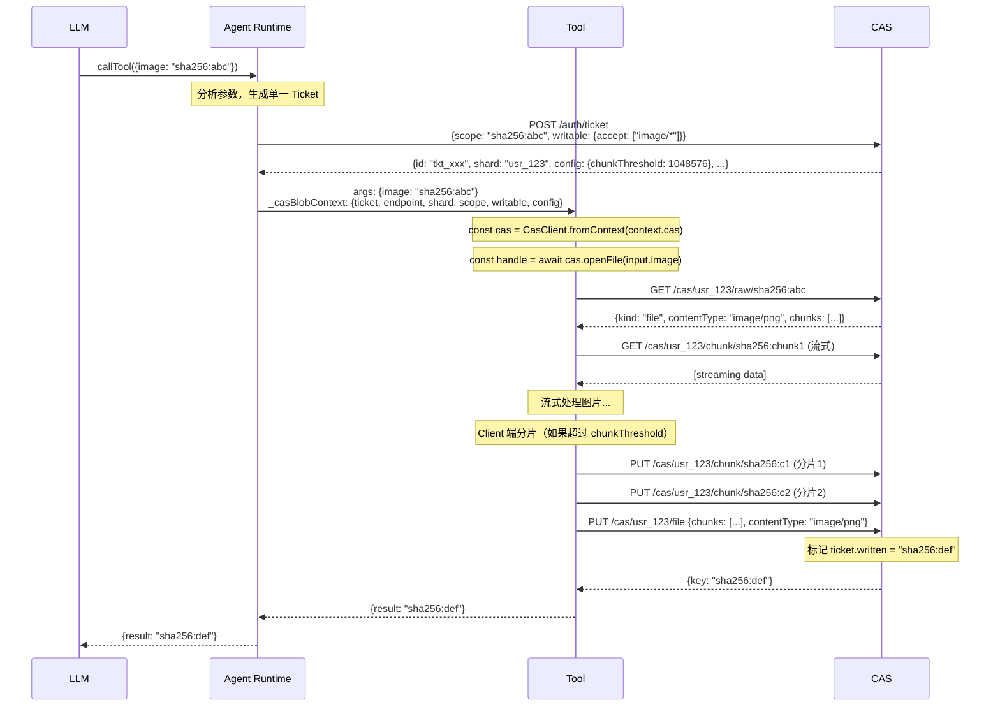

# CAS 存储系统设计

> 基于内容寻址存储（CAS）的 Blob 处理系统，使用 Ticket 机制进行访问控制。
> 核心特性：单一 Ticket 授权、contentType 内置于节点、Client 端分片、流式读写、本地缓存。

## 待办事项

### 阶段一：更新 cas-stack 后端
- [ ] 更新类型定义：scope → shard 重命名，Ticket 新字段
- [ ] 实现 CAS 三级节点结构（collection/file/chunk）
- [ ] 更新数据库层支持新 Ticket 结构
- [ ] 更新认证中间件
- [ ] 更新 API 端点（路径 scope → shard）
- [ ] 新增配置查询 API

### 阶段二：创建 cas-client 包
- [ ] 创建包结构（package.json, tsconfig.json）
- [ ] 实现 CasClient（三种鉴权模式）
- [ ] 实现 Client 端分片逻辑
- [ ] 实现 CasFileHandle（流式读取）
- [ ] 实现 LocalStorageProvider（本地缓存）

### 阶段三：更新 cas-webui
- [ ] 更新 API 调用路径
- [ ] 更新 Ticket 创建表单

---

## 术语说明

| 术语 | 含义 |
|------|------|
| **shard** | 用户命名空间（如 `usr_{userId}`），数据存储的分区 |
| **scope** | Ticket 中的权限边界，CAS key 或 key 数组，代表可访问的 DAG 根节点 |

---

## 认证体系

### 三层认证

```
OAuth/Cognito → User Token → Agent Token → Ticket
```

### 三种鉴权模式

| 模式 | Header 格式 | 用途 |
|------|-------------|------|
| User Token | `Bearer ${token}` | 完整权限，用户直接操作 |
| Agent Token | `Agent ${token}` | 可签发 Ticket，Agent Runtime 使用 |
| Ticket | `Ticket ${id}` | 受限权限，Tool 使用 |

---

## Ticket 设计

### Ticket 结构（DynamoDB Record）

```typescript
interface Ticket {
  pk: string;              // "ticket#{id}"
  type: "ticket";
  createdAt: number;
  expiresAt: number;
  issuerId: string;        // 签发者 ID
  shard: string;           // 用户命名空间（如 "usr_{userId}"）
  
  // 读权限：以这些 key 为根的 DAG 所有节点都可访问
  scope: string | string[];  // 单个 key 或 key 数组
  
  // 写权限（单次写入，保证原子性）
  writable?: boolean | {
    quota?: number;        // 字节数限制
    accept?: string[];     // root 节点允许的 MIME types
  };
  
  // 写入结果（确保只写一次 + 记录结果）
  written?: string;        // 已写入的 root key（写入失败时 revert）
  
  // Server 配置信息（只读，由 Server 填充）
  config: {
    chunkThreshold: number;  // 分片阈值（字节），Client 必须遵守
  };
}
```

### 设计要点

1. **shard 是存储分区**：用户命名空间，数据物理存储的位置
2. **scope 是权限边界**：CAS key 或 key 数组，代表可访问的 DAG 根节点
3. **writable 表达写权限**：存在即有写权限，值可以是 `true` 或带配置的对象
4. **written 保证原子性**：一个 Ticket 只能完成一次写操作，写入后记录 root key
5. **写入失败时 revert**：如果上传过程失败，`written` 字段会被清除，Ticket 可重新使用
6. **config 包含 Server 配置**：Client 从 Ticket 获取分片阈值等配置信息

---

## CAS Server 配置

### 配置类型

```typescript
interface CasServerConfig {
  // 分片阈值（默认 1MB），Client 必须遵守
  chunkThreshold: number;   // CAS_CHUNK_THRESHOLD=1048576
  
  // Collection children 上限（默认 10000）
  maxCollectionChildren: number;  // CAS_MAX_COLLECTION_CHILDREN=10000
  
  // 单次请求最大 payload（默认 10MB）
  maxPayloadSize: number;   // CAS_MAX_PAYLOAD_SIZE=10485760
}
```

### 配置查询 API

```typescript
// GET /cas/config - 获取 Server 配置（无需认证）
interface CasConfigResponse {
  chunkThreshold: number;      // 分片阈值（字节）
  maxCollectionChildren: number;
  maxPayloadSize: number;
}
```

---

## CAS 节点结构

### 三级节点类型

```typescript
type NodeKind = "collection" | "file" | "chunk";
```

| 类型 | 说明 | 特点 |
|------|------|------|
| collection | 类似文件夹，命名结构 | 可递归，children 是 name → key 映射 |
| file | 有 contentType 的内容节点 | 小文件直接存储，大文件引用 chunks |
| chunk | B-tree 结构分片 | 可递归，确保每个节点不过大 |

### 存储层视图：CasRawNode

```typescript
type CasRawNode = CasRawCollectionNode | CasRawFileNode | CasRawChunkNode;

interface CasRawCollectionNode {
  kind: "collection";
  key: string;
  size: number;
  children: Record<string, string>;  // name → key（不展开）
}

interface CasRawFileNode {
  kind: "file";
  key: string;
  size: number;
  contentType: string;
  chunks: string[];  // chunk keys（不合并）
}

interface CasRawChunkNode {
  kind: "chunk";
  key: string;
  size: number;
  parts?: string[];  // 子 chunks（B-tree 递归）
}
```

### 应用层视图：CasNode

```typescript
type CasNode = CasCollectionNode | CasFileNode;

interface CasCollectionNode {
  kind: "collection";
  key: string;
  size: number;
  children: Record<string, CasNode>;  // 递归展开
}

interface CasFileNode {
  kind: "file";
  key: string;
  size: number;
  contentType: string;
  // 注意：没有 content 字段！通过 openFile() 流式读取
}
```

### 设计优势

- **contentType 内置**：无需参数传递，GET 时自动返回
- **无需 blob 标记**：Tool schema 中直接使用 `z.string()` 表示 CAS key
- **大文件友好**：Client 端分片，流式读写

---

## 分片策略

### Client 端分片

**重要**：分片由 Client 端完成，Server 不自动分片。

```typescript
// Client 分片逻辑
class CasClient {
  async putFile(content: Buffer | Readable, contentType: string): Promise<string> {
    const threshold = this.config.chunkThreshold;  // 从 Ticket 获取
    
    if (content.length <= threshold) {
      // 小文件：直接上传
      return this.uploadSingleChunk(content, contentType);
    } else {
      // 大文件：分片后上传
      const chunks = await this.splitIntoChunks(content, threshold);
      const chunkKeys = await Promise.all(
        chunks.map(chunk => this.uploadChunk(chunk))
      );
      return this.uploadFileNode(chunkKeys, contentType);
    }
  }
}
```

### 分片阈值来源

1. **Ticket 中包含**：创建 Ticket 时，Server 自动填充 `config.chunkThreshold`
2. **配置 API 查询**：Client 也可以通过 `GET /cas/config` 获取
3. **默认值**：1MB (1048576 bytes)

---

## CAS Client

### 配置与构造

```typescript
type CasAuth = 
  | { type: "user"; token: string }
  | { type: "agent"; token: string }
  | { type: "ticket"; id: string };

interface CasClientConfig {
  endpoint: string;
  auth: CasAuth;
  storage?: LocalStorageProvider;  // 本地缓存（可选）
  chunkThreshold?: number;         // 可覆盖，默认从 Server 获取
}

class CasClient {
  constructor(config: CasClientConfig);
  
  // 便捷构造方法
  static fromUserToken(endpoint: string, token: string): CasClient;
  static fromAgentToken(endpoint: string, token: string): CasClient;
  static fromTicket(endpoint: string, ticketId: string): CasClient;
  static fromContext(context: CasBlobContext, storage?: LocalStorageProvider): CasClient;
}
```

### 读取 API

```typescript
class CasClient {
  // 获取节点结构（应用层视图，不含内容）
  getNode(key: string): Promise<CasNode>;
  
  // 获取原始节点（存储层视图，暴露 chunks）
  getRawNode(key: string): Promise<CasRawNode>;
  
  // 打开文件，获取 handle（用于流式读取）
  openFile(key: string): Promise<CasFileHandle>;
  
  // 获取 chunk 数据流（带缓存）
  getChunkStream(key: string): Promise<Readable>;
}
```

### 文件 Handle（流式读取）

```typescript
interface CasFileHandle {
  readonly key: string;
  readonly size: number;
  readonly contentType: string;

  // 流式读取完整内容
  stream(): Promise<Readable>;

  // 读取完整内容到 Buffer（小文件便捷方法）
  buffer(): Promise<Buffer>;

  // 范围读取（支持 seek，适用于视频等）
  slice(start: number, end: number): Promise<Readable>;
}
```

### 写入 API

```typescript
class CasClient {
  // 上传单个文件（支持 Buffer 或 Readable）
  putFile(content: Buffer | Readable, contentType: string): Promise<string>;
  
  // 上传 Collection（通过 callback 遍历虚拟文件系统）
  putCollection(resolver: PathResolver): Promise<string>;
}

// 路径解析结果
type PathResolution = 
  | { type: "file"; content: Buffer | Readable | (() => Readable); contentType: string }
  | { type: "collection"; children: string[] }
  | { type: "link"; target: string }  // hard link 到已有 key
  | null;

// 路径解析器
type PathResolver = (path: string) => Promise<PathResolution>;
```

---

## 本地缓存 Provider

```typescript
interface LocalStorageProvider {
  // 检查节点是否已缓存
  has(key: string): Promise<boolean>;
  
  // 获取缓存的原始节点元数据
  getMeta(key: string): Promise<CasRawNode | null>;
  
  // 获取 chunk 数据（流式）
  getChunkStream(key: string): Promise<Readable | null>;
  
  // 写入节点元数据
  putMeta(key: string, node: CasRawNode): Promise<void>;
  
  // 写入 chunk 数据（流式）
  putChunkStream(key: string): Writable;
  
  // 清理缓存（可选）
  prune?(options?: { maxSize?: number; maxAge?: number }): Promise<void>;
}

// 文件系统实现
class FileSystemStorageProvider implements LocalStorageProvider {
  constructor(cacheDir: string);
}
```

---

## Tool Context

```typescript
// _casBlobContext 结构，与 Ticket 权限一致
interface CasBlobContext {
  ticket: string;           // Ticket ID
  endpoint: string;         // CAS API endpoint
  expiresAt: string;        // ISO 8601
  shard: string;            // 用户命名空间
  
  // 权限信息（镜像 Ticket）
  scope: string | string[];
  writable: false | true | {
    quota?: number;
    accept?: string[];
  };
  
  // Server 配置
  config: {
    chunkThreshold: number;
  };
}
```

---

## CAS API 端点

### 配置端点

```typescript
// GET /cas/config - 获取 Server 配置（无需认证）
// Response: CasConfigResponse
```

### 认证端点

```typescript
// POST /auth/ticket - 创建 Ticket（需要 User/Agent Token）
interface CreateTicketRequest {
  scope: string | string[];  // 可访问的 DAG 根节点
  writable?: boolean | {
    quota?: number;
    accept?: string[];
  };
  expiresIn?: number;        // 秒，默认 3600
}

interface CreateTicketResponse {
  id: string;
  expiresAt: string;
  shard: string;
  scope: string | string[];
  writable: boolean | { quota?: number; accept?: string[] };
  config: {
    chunkThreshold: number;
  };
}
```

### 节点端点

```typescript
// GET /cas/{shard}/node/{key} - 获取应用层节点
// Response: CasNode（collection 展开 children，file 不含 content）

// GET /cas/{shard}/raw/{key} - 获取存储层节点
// Response: CasRawNode（暴露 chunks 结构）

// GET /cas/{shard}/chunk/{key} - 获取 chunk 原始数据
// Response: Binary data（流式）

// PUT /cas/{shard}/chunk/{key} - 上传 chunk（Client 分片后调用）
// Request: Binary data
// Response: { key: string, size: number }

// PUT /cas/{shard}/file - 上传 file 节点（引用已上传的 chunks）
// Request: { chunks: string[], contentType: string }
// Response: { key: string }

// PUT /cas/{shard}/collection - 上传 collection 节点
// Request: { children: Record<string, string> }
// Response: { key: string }
```

---

## 使用示例

### Tool 中处理图片

```typescript
const imageProcessor = defineTool({
  input: z.object({ image: z.string() }),  // CAS key，无需特殊标记
  output: z.object({ result: z.string() }), // CAS key
  handler: async (input, context) => {
    const cas = CasClient.fromContext(context.cas);
    
    // 流式读取（自动合并 chunks）
    const handle = await cas.openFile(input.image);
    const inputStream = await handle.stream();
    
    // 流式处理
    const outputStream = inputStream.pipe(sharp().resize(800, 600));
    
    // 流式上传
    const resultKey = await cas.putFile(outputStream, "image/png");
    
    return { result: resultKey };
  },
});
```

### 上传多文件结果

```typescript
const resultKey = await cas.putCollection(async (path) => {
  if (path === "/") {
    return { type: "collection", children: ["image.png", "metadata.json"] };
  }
  if (path === "/image.png") {
    return { type: "file", content: imageBuffer, contentType: "image/png" };
  }
  if (path === "/metadata.json") {
    return { type: "file", content: jsonBuffer, contentType: "application/json" };
  }
  return null;
});
```

### 使用 Hard Link

```typescript
const resultKey = await cas.putCollection(async (path) => {
  if (path === "/") {
    return { type: "collection", children: ["original.png", "copy.png"] };
  }
  if (path === "/original.png") {
    return { type: "file", content: buffer, contentType: "image/png" };
  }
  if (path === "/copy.png") {
    // Hard link 到已有节点，避免重复存储
    return { type: "link", target: "sha256:abc123..." };
  }
  return null;
});
```

---

## 包结构

```
packages/
├── cas-stack/              # CAS Server（更新）
│   └── src/
│       ├── types.ts        # 更新 Ticket 结构，scope → shard
│       ├── cas/
│       │   └── storage.ts  # 节点存储
│       └── router.ts       # API 端点
│
├── cas-client/             # 新包：CAS Client
│   ├── package.json
│   ├── index.ts
│   └── src/
│       ├── client.ts       # CasClient 类
│       ├── chunker.ts      # Client 端分片逻辑
│       ├── file-handle.ts  # CasFileHandle 实现
│       ├── storage.ts      # LocalStorageProvider
│       └── types.ts
```

---

## 流程图



---

## 写入原子性

### 成功流程
1. Client 上传所有 chunks
2. Client 上传 file/collection 节点
3. Server 标记 `ticket.written = rootKey`
4. 返回成功

### 失败处理
1. 如果任何步骤失败，Client 可以重试
2. `ticket.written` 只有在最终节点成功后才设置
3. 孤立的 chunks 可以通过 GC 清理（基于 ownership 追踪）

---

## 设计总结

| 方面 | 设计 |
|------|------|
| **术语** | shard = 用户命名空间，scope = 权限边界（DAG 根） |
| **Ticket** | 包含 shard + scope + writable + config，written 保证原子性 |
| **分片** | **Client 端分片**，阈值从 Ticket/API 获取 |
| **节点结构** | collection/file/chunk 三级，contentType 内置 |
| **Schema** | 无需 blob 标记，直接用 string 表示 CAS key |
| **读取** | getNode() + getRawNode() + openFile()，流式读取 |
| **写入** | putFile() + putCollection(callback)，Client 分片后上传 |
| **缓存** | LocalStorageProvider，基于 hash 天然去重 |
| **失败恢复** | 写入失败可重试，Ticket 不消费 |

---

## 关键实现参考

- CAS API 路由：`packages/cas-stack/src/router.ts`
- CAS 存储实现：`packages/cas-stack/src/cas/storage.ts`
- Ticket 类型定义：`packages/cas-stack/src/types.ts`
- 认证中间件：`packages/cas-stack/src/middleware/auth.ts`
